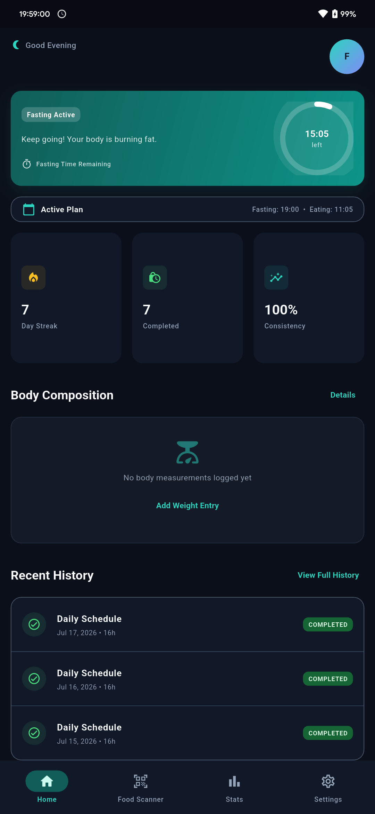
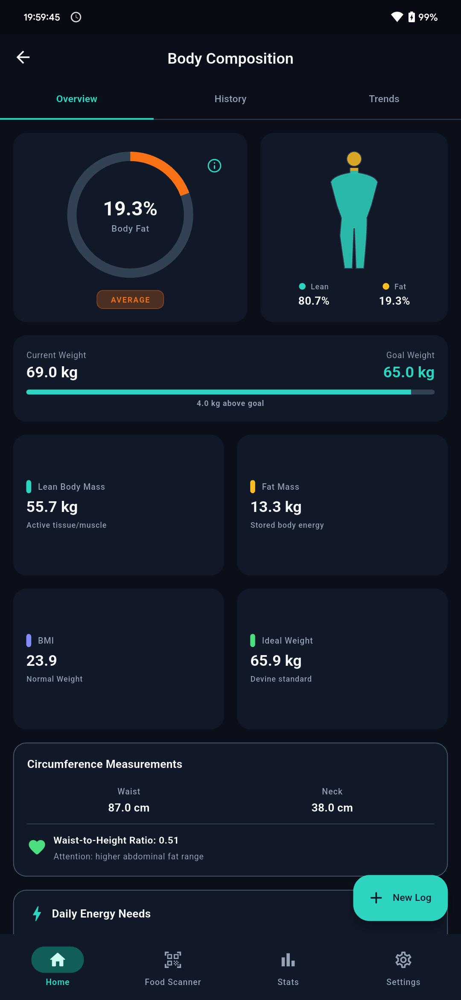
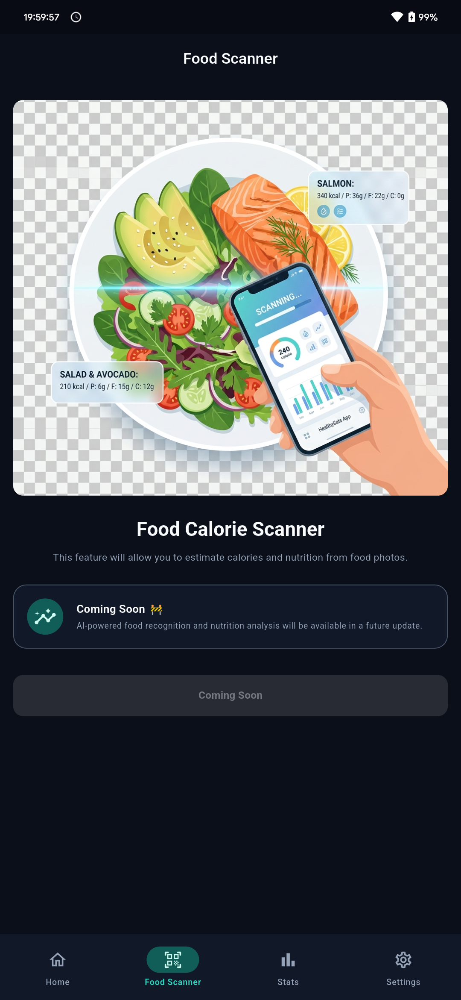
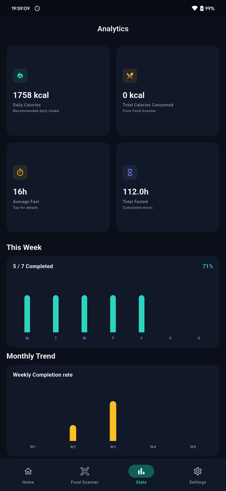

# Fomo IF - Intermittent Fasting & Body Composition Tracker

A modern, offline-first Flutter application for intermittent fasting tracking and body composition monitoring. Built with Clean Architecture, Riverpod, and Material 3.

## Features

### Fasting Tracker & Notifications
- **Schedule-driven engine** - No start/stop buttons needed. The app automatically determines your fasting state from the current time and your daily schedule.
- **Real-time countdown** - Live timer updating every second with circular progress ring
- **Multiple fasting windows** - Different fasting/eating times for each day of the week
- **Timeline view** - Yesterday, Today, Tomorrow with scheduled vs actual times
- **Calendar view** - Monthly overview with completion markers
- **Manual overrides** - Mark sessions as completed, skipped, or cancelled with custom times
- **Copy Monday to All** - Quick setup for consistent weekly schedules
- **Redesigned Notification UI** - Modern Material 3 custom style featuring dynamic stage calculations (e.g., `16:8 Fast`), percentage completion displays, and a clean thin horizontal progress indicator (4dp height).

### Nutrition & Calorie Tracker (Redesigned Statistics)
- **Daily Calorie Requirement** - Miffln-St Jeor calorie needs calculation using user profiles (age, gender, height, weight) with custom activity multipliers and weight goals.
- **Nutrition Details Page** - Targets for calories, protein, fat, carbohydrates, fiber, and water intake with educational advice cards.
- **Total Calories Consumed** - Real-time summation of calories from all food scanner history logs.
- **Food Intake Summary Page** - Review calorie, protein, fat, carb, and fiber totals, and simulate logging via mock scanners.

### Body Composition & History
- **US Navy Body Fat Formula** - Accurate body fat % from waist, neck, hip measurements
- **Automatic calculations** - BMI, BMR, TDEE, Lean Mass, Fat Mass
- **Health categories** - Essential Fat, Athlete, Fitness, Average, Obese (gender-specific)
- **Progress photos** - Front, side, back views with timeline
- **Measurement history** - Weight, waist, neck, hip, chest, arms, thighs, calves
- **Charts** - Weight, body fat %, lean mass, fat mass, BMI, waist, chest, arms, thighs, calves (weekly/monthly/yearly/all time)

### Smart Robustness Features
- **100% Offline Execution** - Bundled local Google Fonts (Inter) assets and disabled runtime network fetching to guarantee full offline compatibility.
- **Initialization Timeout Guard** - Service initializations run concurrently and are capped by a 4-second timeout to ensure the splash screen never freezes.
- **Fail-Safe Hive Storage** - Box openings run with 4-level automatic recovery/deletion and temp path fallbacks.
- **Crash Prevention** - Try-catch wraps in Android 12+ foreground services, AppWidgetProviders, and notification engines prevent background execution crashes.
- **Data export/import** - Full JSON backup/restore
- **Dark/Light theme** - System-aware with manual override
- **Onboarding** - 4-step setup flow (Welcome, Profile, Goals, Schedule)

### Visual & Premium Polish
- **Adaptive Elevation & Shadow System**: Implemented a global premium card design system via `AppCard` using Material 3 `ColorScheme.surface` backgrounds, borderless outlines, and a modern shadow system:
  - *Light Mode*: Soft ambient shadow (`alpha: 0.08`, `blurRadius: 16`).
  - *Dark Mode*: Combined deep ambient shadow (`alpha: 0.45`, `blurRadius: 20`) and high-contrast neon inner rim glow (`alpha: 0.04`, `blurRadius: 2`) for exceptional card floating depth.
  - *Corner Radius*: 24.0 corner radius matching modern platforms (Google Wallet, Apple Health).
- **Unified Logger**: Consolidated code-wide diagnostic tracing using a safe production-aware `LoggerService`, completely stripping all console log execution in release builds.

---

## Setup & Configuration

### Gemini AI API Key
The **Scan Real Food (AI)** scanner requires a Google Gemini API Key.
1. Create a `.env` file in the root directory of the project.
2. Add your API key:
   ```env
   GEMINI_API_KEY=your_actual_google_gemini_api_key_here
   ```
3. Run `flutter pub get` and build the application.

---

## Screenshots

<p align="center">
  
  
  
  
</p>

---


