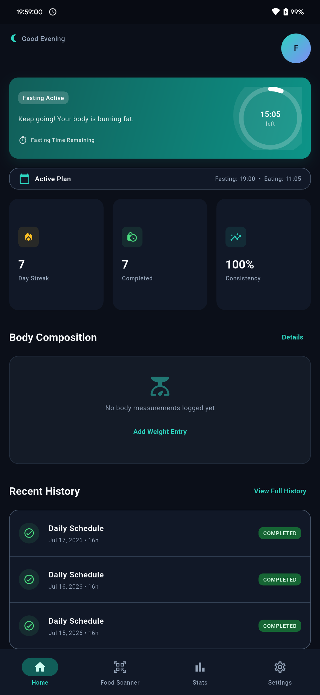
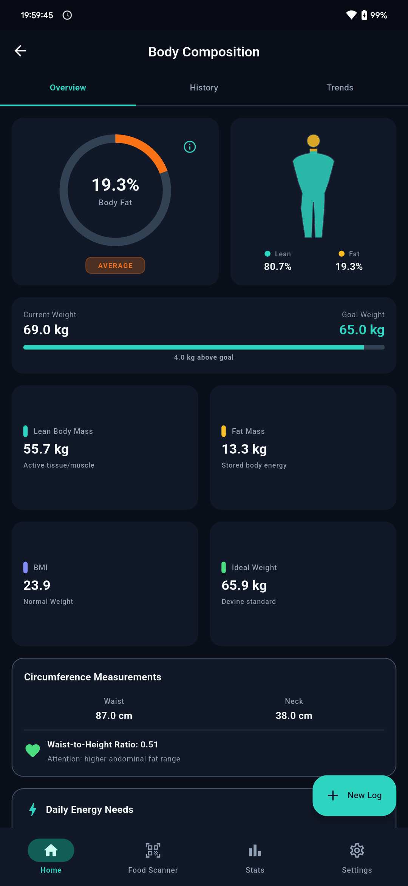
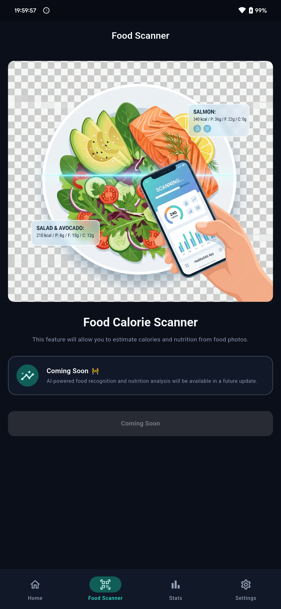
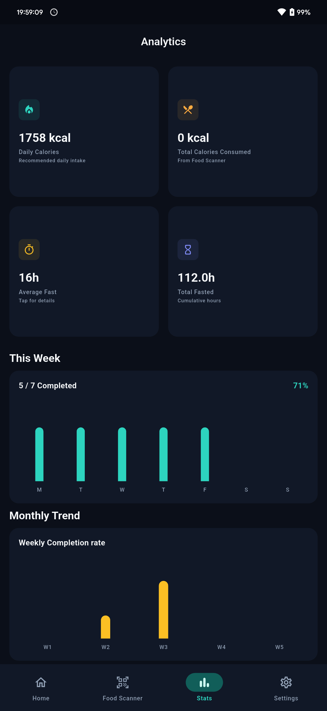

# Fomo IF - Intermittent Fasting & Body Composition Tracker

A modern, offline-first Flutter application for intermittent fasting tracking and body composition monitoring. Built with Clean Architecture, Riverpod, and Material 3.

## Features

### Fasting Tracker & Notifications
- **Schedule-driven engine** - No start/stop buttons needed. The app automatically determines your fasting state from the current time and your daily schedule.
- **Real-time countdown** - Live timer updating every second with circular progress ring.
- **Scheduled Fasting Reminders** - Configurable scheduled alerts (10 min before fasting, at fasting start, 10 min before Iftar, at Iftar time) with custom raw sound resources (`fast.mp3`, `eat.mp3`, System Default, or Silent).
- **Timezone-Safe Alarm Scheduling** - Exact alarms via `AndroidScheduleMode.exactAllowWhileIdle` and timezone-safe `tz.TZDateTime`.
- **Multiple fasting windows** - Different fasting/eating times for each day of the week.
- **Timeline view** - Yesterday, Today, Tomorrow with scheduled vs actual times.
- **Calendar view** - Monthly overview with completion markers.
- **Manual overrides** - Mark sessions as completed, skipped, or cancelled with custom times.

### High-Performance Startup & Cloud Sync
- **Non-Blocking Fast Startup (<0.85s)** - Main screen UI renders in under 850ms by deferring heavy network and background initializations to post-frame execution.
- **Firebase & Cloudflare Scheduler Integration** - Automatic schedule and device token synchronization with Cloudflare Workers.
- **Device ID Resolution & Deduplication** - Canonical device document mapping with automatic token deduplication.

### Nutrition & Calorie Tracker (Redesigned Statistics)
- **Daily Calorie Requirement** - Mifflin-St Jeor calorie needs calculation using user profiles with custom activity multipliers and weight goals.
- **Scan Real Food (AI)** - Powered by Google Gemini (`gemini-3.5-flash`) for meal photo nutritional analysis.
- **Nutrition Details Page** - Targets for calories, protein, fat, carbohydrates, fiber, and water intake.
- **Total Calories Consumed** - Real-time summation of calories from all food logs.
- **Average Fast Details** - Comprehensive fast metrics incorporating shortest, longest, and average fasting durations.
- **Standalone Exercises Journal** - Log workouts, sets, reps, weights, and ACSM MET estimated calories burned.

### Body Composition & History
- **US Navy Body Fat Formula** - Accurate body fat % from waist, neck, hip measurements.
- **Automatic calculations** - BMI, BMR, TDEE, Lean Mass, Fat Mass.
- **Health categories** - Essential Fat, Athlete, Fitness, Average, Obese (gender-specific).
- **Progress photos** - Front, side, back views with timeline.
- **Measurement history** - Weight, waist, neck, hip, chest, arms, thighs, calves.
- **Charts** - Weight, body fat %, lean mass, fat mass, BMI (weekly/monthly/yearly/all time).

### Smart Robustness Features
- **100% Offline Core Logic** - Bundled local Google Fonts (Inter) assets and disabled runtime network fetching.
- **Fail-Safe Hive Storage** - Box openings run with 4-level automatic recovery/deletion and temp path fallbacks.
- **Data export/import** - Full JSON backup/restore.
- **Dark/Light theme** - System-aware with manual override.
- **Onboarding** - 4-step setup flow (Welcome, Profile, Goals, Schedule).

---

## Screenshots

  
  
  
  

